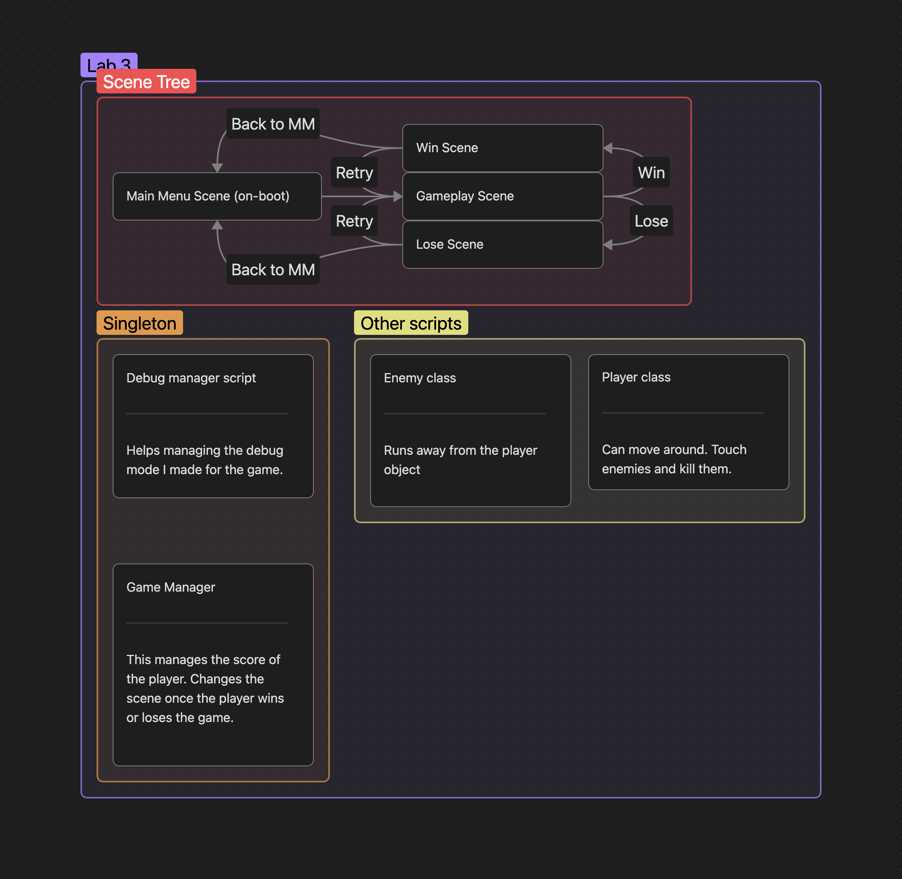

# Student Details

> Name: Sidharth Suresh (Sid)

> Student ID: 100938544

# Tick vs. Cross

## Basic description

A game made to show off the use of singletons. Its a game where you move around and kill enemies to get points. There is no losing in the game. Did not have time to think through all the mechanics.

## Graph

(Forgot to add this to the mix. Singletons such as debug and game manager were implemented that way to make use of their functions and variables between scenes.)

# Reflection

- What system within your project uses a Singleton, and why did you choose this system to adopt the pattern? 

My game score manager and debug manager used singletons. I chose singletons to manage those systems because I wanted to use the variables and functions I put in those functions to be used throughout the project and not just one scene.

- Do you think this design pattern is beneficial for this purpose? Explain why or why not.

As explained in the question from before. It could be used to manage things on a full project basis rather than a scene to scene basis.

# References

- Minecraft block model was taken from: https://minecraft.wiki
